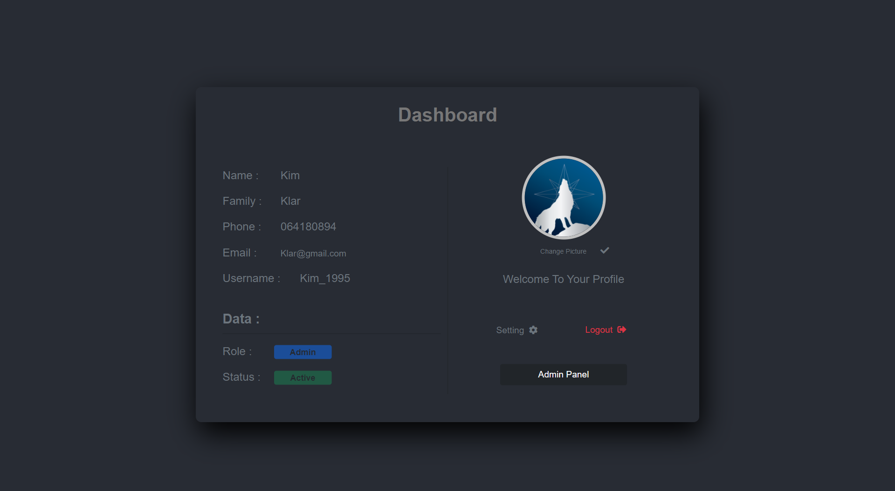

# PHP Panel

Login / Signup / User Dashboard / Admin Panel

Simple and optimized PHP Panel It includes: 

 
- [x] PHP 8.1
- [x] ECMAScript 6+
- [x] MYSQL - PDO

## Start

1. `git clone https://github.com/am-abazari/PHP-Panel.git`
2. Run `Wampserver64` or `XAMPP`
3. Import `formcms.sql` into Database
4. Open [http://localhost/PHP/Panel/MainPage.php](http://localhost/PHP/Panel/MainPage.php)

## Code Coverage

The project is using the <strong>PHP , MYSQL</strong>. All Connection configurations are located in `Common/Connection.php`

## About Author

<strong>Amirhossein Abazari</strong> Full-Stack Web Developer
